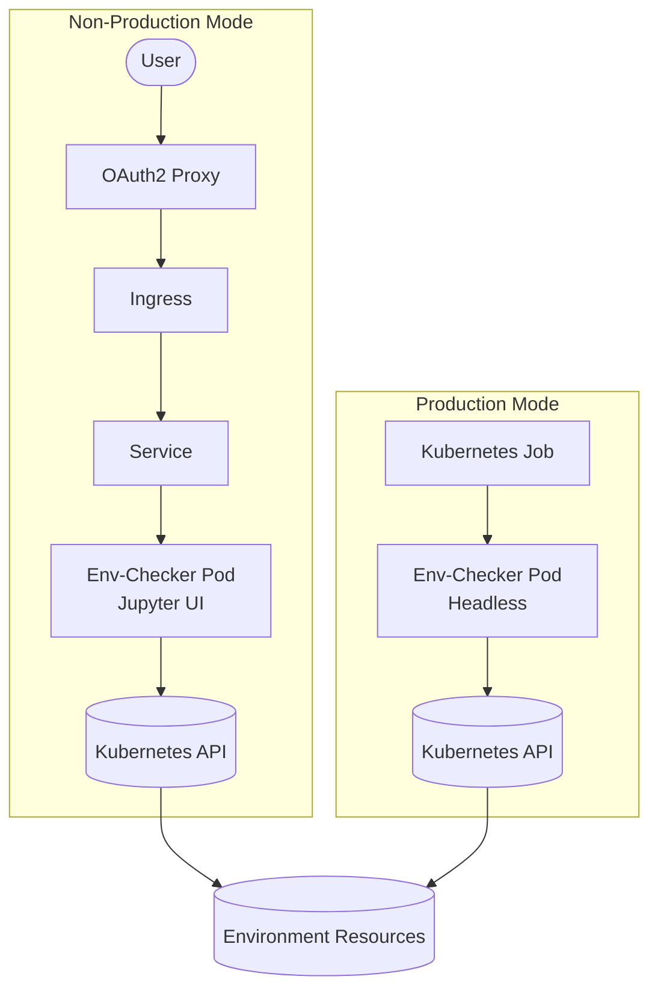

# Qubership Environment Checker

[](https://github.com/Netcracker/qubership-env-checker/actions/workflows/build.yaml)
[](https://github.com/Netcracker/qubership-env-checker/pkgs/container/qubership-env-checker)
[](https://github.com/Netcracker/qubership-env-checker/releases)
[](docs/InstallationGuide.md)

An independent microservice designed to validate Kubernetes or OpenShift environments in the cloud. Built on Jupyter ecosystem (JupyterLab + JupyterHub), this environment checker inspects infrastructure, Kubernetes entities, labels, annotations, variables, and more. It generates detailed reports that can be sent to storage or monitoring systems for identifying and troubleshooting environment issues.

## Features

- **Environment Validation**: Comprehensive validation of Kubernetes and OpenShift environments
- **Infrastructure Inspection**: Analyze Kubernetes entities, labels, annotations, and variables
- **Detailed Reporting**: Generate comprehensive reports for troubleshooting and monitoring
- **Flexible Deployment Modes**: Two distinct operational modes for different environments
- **Real-time Debugging**: Interactive environment analysis through Jupyter-based interface
- **Automated Execution**: Job-based execution for production environments
- **Authentication Integration**: OAuth2/Keycloak integration for secure access in non-production
- **Cloud-Native**: Designed specifically for cloud Kubernetes deployments

## Deployment Modes

The env-checker supports two operational modes:

### 🔧 Non-Production Mode

- **Interactive UI**: Full Jupyter interface (JupyterLab + JupyterHub) for real-time debugging
- **OAuth2 Authentication**: Secure web access via Keycloak/IDP integration
- **Architecture**: `OAuth2 Proxy` → `Ingress` → `Service` → `Env-Checker Pod`

### 🔒 Production Mode

- **Job-based Execution**: Automated validation via Kubernetes Jobs/CronJobs
- **No UI Access**: No web interface or interactive components
- **Architecture**: `Kubernetes Job` → `Env-Checker Pod`

> **⚠️ Security**: Different modes exist because env-checker requires cluster-wide `view` permissions. Production mode eliminates interactive access.

## Requirements

| Component  | Requirement | Version |
|------------|-------------|---------|
| Kubernetes | Mandatory   | 1.21+   |
| Helm       | Mandatory   | 3.0+    |
| Docker     | Optional    | 20.0+   |

> **Note**: This service installs last stable kubectl version internally. Ensure compatibility with your cluster version.

## Installation

### Quick Start

```bash
# Non-Production Mode (with UI without Ingress)
helm upgrade --install qubership-env-checker \
    --namespace=env-checker --create-namespace \
    charts/env-checker

# Production Mode (Job-only)
helm upgrade --install qubership-env-checker \
    --namespace=env-checker --create-namespace \
    --set PRODUCTION_MODE=true \
    --set ENVIRONMENT_CHECKER_JOB_COMMAND="python /scripts/validate.py" \
    charts/env-checker
```

For detailed installation instructions, hardware requirements, and advanced configuration, see the [Installation Guide](docs/InstallationGuide.md).

### Required RBAC Configuration

⚠️ **Security Considerations**: The env-checker requires cluster-wide `view` permissions to inspect Kubernetes resources across all namespaces. This is necessary for comprehensive environment validation but represents significant access. **Manual RBAC configuration is required** to ensure explicit authorization.

Create the necessary ClusterRoleBinding for the service account:

```yaml
apiVersion: rbac.authorization.k8s.io/v1
kind: ClusterRoleBinding
metadata:
  name: view-for-env-checker
subjects:
  - kind: ServiceAccount
    name: env-checker-sa
    namespace: env-checker  # Replace with your namespace
roleRef:
  apiGroup: rbac.authorization.k8s.io
  kind: ClusterRole
  name: view
```

> **Why such broad permissions?** The env-checker needs to validate infrastructure components, inspect labels/annotations on resources across namespaces, analyze network policies, check resource quotas, and examine cluster-wide configurations. The `view` ClusterRole provides read-only access to most Kubernetes resources cluster-wide.

## Usage

**Non-Production Mode**: Access Jupyter UI via browser, create/run notebooks interactively
**Production Mode**: Pre-built validation scripts run as Kubernetes Jobs/CronJobs

**Access UI** (Non-Production only):

```bash
kubectl port-forward svc/env-checker 8888:8888 -n env-checker
# Then open http://localhost:8888
```

## Configuration

| Parameter | Mode | Mandatory | Default | Description |
|-----------|------|-----------|---------|-------------|
| `PRODUCTION_MODE` | Both | No | `false` | Controls deployment mode |
| `CLOUD_PUBLIC_HOST` | Non-Prod | No | `qubership` | Public host for Ingress (set real domain if using Ingress) |
| `OPS_IDP_URL` | Non-Prod | No | - | Keycloak URL (enables OAuth2) |
| `ENVCHECKER_KEYCLOACK_*` | Non-Prod | No | - | Keycloak credentials (required if OAuth2 enabled) |
| `ENVIRONMENT_CHECKER_UI_ACCESS_TOKEN` | Non-Prod | No | *auto* | UI access token |
| `ENVIRONMENT_CHECKER_JOB_COMMAND` | Prod | Yes | - | Job execution command |
| `ENVIRONMENT_CHECKER_CRON_*` | Prod | No | - | CronJob settings |

> **Note**: Namespace is set via `--namespace`, not `--set NAMESPACE`

### OpenShift Configuration

For OpenShift deployments, set:

```yaml
CHOWN_HOME: "yes"
CHOWN_HOME_OPTS: "-R"
```

See the complete parameter reference in the [Installation Guide](docs/InstallationGuide.md).

## API Reference

The env-checker utilizes the Jupyter Server API (v2.0+) without extensions. For detailed API documentation, refer to the [Jupyter Server API documentation](https://jupyter-server.readthedocs.io/en/latest/developers/rest-api.html).

## Architecture



## Testing

**Verify deployment:**

```bash
kubectl get pods -n env-checker
kubectl logs -l app.kubernetes.io/name=env-checker -n env-checker
```

**Test API access:**

```bash
kubectl exec -it deployment/env-checker -n env-checker -- kubectl get ns
```

**Troubleshooting**: If kubectl fails, verify ClusterRoleBinding and RBAC permissions. See [Installation Guide](docs/InstallationGuide.md#tests) for details.

## Contributing

Please read [CONTRIBUTING.md](CONTRIBUTING.md) for details on our code of conduct and the process for submitting pull requests.

See also:

- [Code of Conduct](CODE-OF-CONDUCT.md)
- [Security Policy](SECURITY.md)
